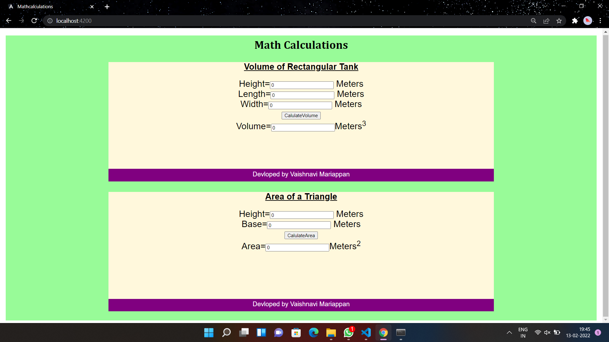

# AngularCalculation

# Web Page for Mathematical Calculations using Angular

## AIM:
To design a dynamic website to perform mathematical calculations using Angular Framwork

## DESIGN STEPS:

### Step 1:

Requirement collection.

### Step 2:

Creating the layout using HTML and CSS in component.html file

### Step 3:

Write typescript to perform the calculations.

### Step 4:

Validate the layout in various browsers.

### Step 5:

Validate the HTML code.

### Step 6:

Publish the website in the given URL.

## PROGRAM :
### index.html:
```
<!doctype html>
<html lang="en">
<head>
  <meta charset="utf-8">
  <title>Mathcalculations</title>
  <base href="/">
  <meta name="viewport" content="width=device-width, initial-scale=1">
  <link rel="icon" type="image/x-icon" href="favicon.ico">
</head>
<body>
  <app-root></app-root>
</body>
</html>
```
### rectangulartank.component.html Code:
```
<div>
    Height=<input type="text" [(ngModel)]="height"> Meters<br/>
    Length=<input type="text" [(ngModel)]="length"> Meters<br/>
    Width=<input type="text" [(ngModel)]="width"> Meters<br/>
        <input type="button" (click)="onCalculate()" value="CalulateVolume"><br/>
    Volume=<input type="text" [value]="volume">Meters<sup>3</sup>
</div>
```
### rectangulartank.component.ts Code:
```
import { Component } from "@angular/core";

@Component({
    selector:'Rectangulartank-Volume',
    templateUrl:'./rectangulartank.components.html'
})
export class RectangulartankComponent{
    height:number;
    length:number;
    width:number;
    volume:number;
    constructor(){
        this.height=0;
        this.length=0;
        this.width=0;
        this.volume=this.height*this.length*this.width;
    }
    onCalculate()
    {
        this.volume=this.height*this.length*this.width;
    }
}
```
### triangle.component.html Code:
```
<div>
    Height=<input type="text" [(ngModel)]="height"> Meters<br/>
    Base=<input type="text" [(ngModel)]="base"> Meters<br/>
        <input type="button" (click)="onCalculate()" value="CalulateArea"><br/>
    Area=<input type="text" [value]="area">Meters<sup>2</sup>
</div>
```
### triangle.ts Code:
```
import { Component } from "@angular/core";

@Component({
    selector:'Triangle-Area',
    templateUrl:'./triangle.component.html'
})
export class TriangleComponent{
    height:number;
    base:number;
    area:number;
    constructor(){
        this.height=0;
        this.base=0;
        this.area = 1/2*this.height*this.base;
    }
    onCalculate()
    {
        this.area = 1/2*this.height* this.base;
    }
}
```
### app.module.ts:
```
import { NgModule } from '@angular/core';
import { FormsModule } from '@angular/forms';
import { BrowserModule } from '@angular/platform-browser';

import { AppComponent } from './app.component';
import { RectangulartankComponent } from './rectangulartank/rectangulartank.component';
import { TriangleComponent } from './triangle/triangle.component';

@NgModule({
  declarations: [
    AppComponent, TriangleComponent, RectangulartankComponent
  ],
  imports: [
    BrowserModule,FormsModule
  ],
  providers: [],
  bootstrap: [AppComponent]
})
export class AppModule { }
```
### app.component.html:
```
<style>
    *{
box-sizing: border-box;
font-family: Arial, Helvetica, sans-serif;
}

body{
background-color: palegreen;
color: black;
}

.container{
text-align: center;
width: 1080px;
height: 800px;
margin-left: auto;
margin-right: auto;
}

.content{
display: block;
width: 100%;
margin-left: auto;
margin-right: auto;
background-color: cornsilk;
margin-top: 30px;
min-height: 300px;
}

h1{
color: rgb(0, 0, 0);
text-align: center;
padding-top: 7px;
font-family: Cambria, Cochin, Georgia, Times, 'Times New Roman', serif;
}

.formelement{
padding-top: 15px;
font-size:25px;
text-align: center;
}

.footer{
display: inline-block;
width: 100%;
height: 35px;
background-color: purple;
color:white;
text-align: center;
padding-top: 5px;
font-size: large;
}

</style>


<body>
    <div class="container">
    <h1>Math Calculations</h1>
    <div class="content">
        <h2><u>Volume of Rectangular Tank</u></h2>
        <Rectangulartank-Volume class="formelement"></Rectangulartank-Volume>
    </div>
    <div class="footer">
        Devloped by Vaishnavi Mariappan
    </div>
    <div class="content">
        <h2><u>Area of a Triangle</u></h2>
        <Triangle-Area class="formelement"></Triangle-Area>
    </div>
    <div class="footer">
        Devloped by Vaishnavi Mariappan
    </div>
    </div>

</body>
```
## OUTPUT:



### Home Page:


## Result:
Thus a Mathmetical Calculation website is created using Angular.
